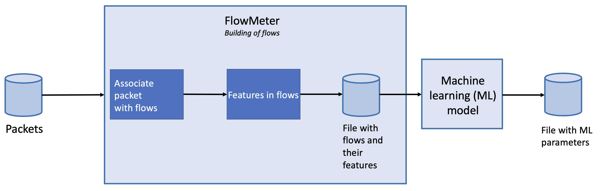

# FlowMeter

Deepfence FlowMeter is an experimental utility built to analyse and classify packets by looking at packet headers. We use FlowMeter internally to quickly analyse and label packets.

## Primary design goals

  * Classify packets and flows as benign or malicious with high true positives (TP) and low false positives (FP)
  * Use the labeled data to reduce amount of traffic requiring deeper analysis

Deepfence FlowMeter categorizes packets into flows and shows a rich ensemble of flow data and statistics.

## Architecture

|  |
| :--: | 
| *FlowMeter takes packets and returns file with statistics of flows.* |

|  |
| :--: |
| *Flowmeter takes packets and returns file with statistics of flows and classifies packets as benign or malicious.* |

## When to use FlowMeter

Deepfence FlowMeter is an experimental utility. One area of investigation to better understand how to rapidly filter traffic based on lightweight metadata such as arrival time, packet size, and flow length. When inspecting large datasets or live datastreams, FlowMeter calculations could discard flows that have a very high probability of benign. The resulting packets could then be processed in depth to look for indicators of attack.