# Quick Start



## Build FlowMeter

Build FlowMeter from source using the golang toolchain.

```bash
git clone https://github.com/deepfence/FlowMeter.git
cd FlowMeter

# Install libpcap package.
# Ubuntu/Debian:  sudo apt-get install libpcap0.8-dev
# RHEL/Centos:    sudo yum install install libpcap-devel

make
```
or
```
go build cmd/flowmeter.go
```

## Obtain Sample Training Data

```bash
# Download pcap files.
mkdir packets

wget https://deepfence-public.s3.amazonaws.com/pcap-datasets/webgoat.pcap -P packets
wget https://deepfence-public.s3.amazonaws.com/pcap-datasets/benign_2017-05-02_kali-normal22.pcap -P packets

# Generate CSVs for flows
./flowmeter -ifLiveCapture=false -fname=webgoat -maxNumPackets=40000000 -ifLocalIPKnown false
./flowmeter -ifLiveCapture=false -fname=benign_2017-05-02_kali-normal22 -maxNumPackets=40000000 -ifLocalIPKnown false
```

## Generate ML parameters and classify packets:

```bash
cd FlowMeter/assets

python Deepfence_ML_flowmeter.py

cd ../pkg/

./flowmeter -ifLiveCapture=false -fname=webgoat -maxNumPackets=40000000 -ifLocalIPKnown false
./flowmeter -ifLiveCapture=false -fname=benign_2017-05-02_kali-normal22 -maxNumPackets=40000000 -ifLocalIPKnown false
```

## Sample Results

FlowMeter gives a rich set of features about flows from packet data, and classifies packets as benign or malicious.

|  |
| :--: |
| *FlowMeter takes packets and returns file with statistics of flows.* |


