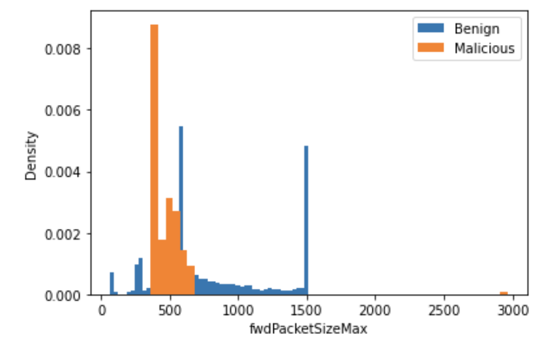
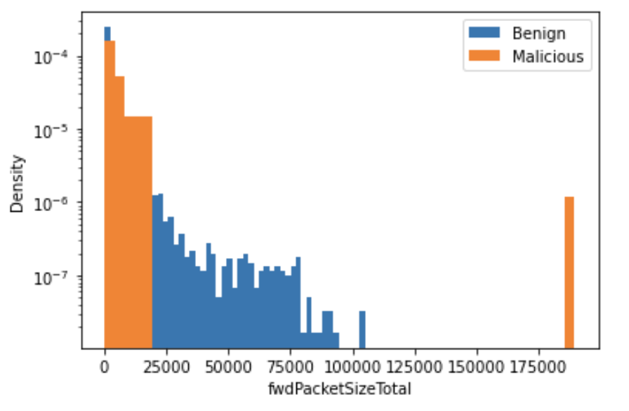
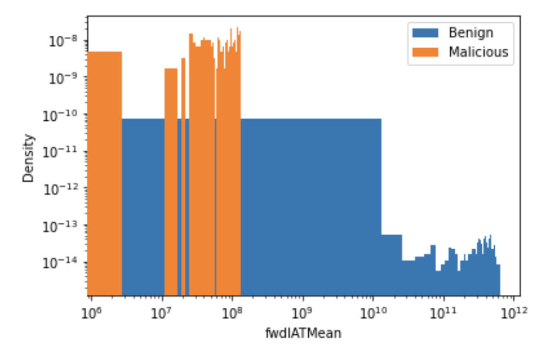
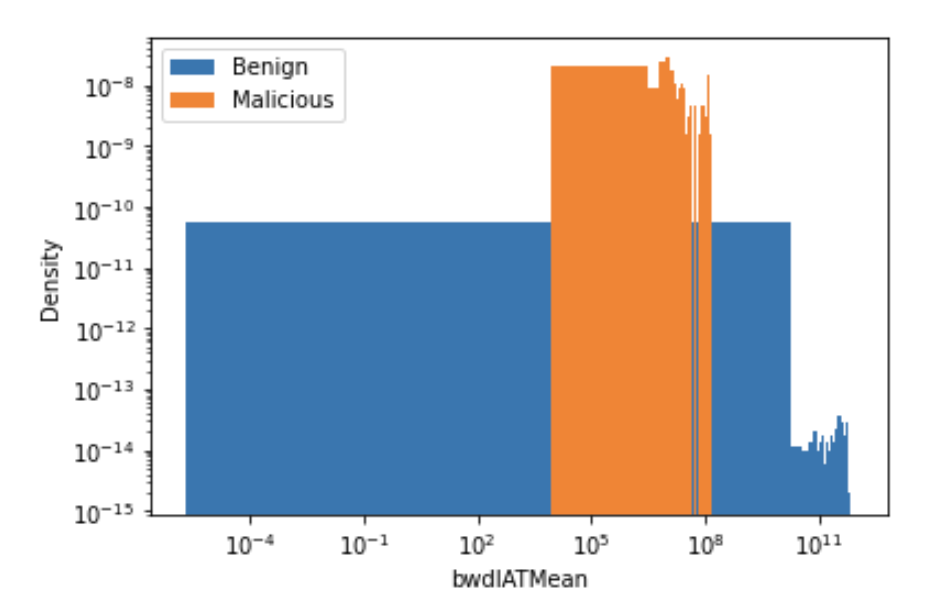

# Data Analysis

FlowMeter observes the following features from packets and constructs flows. 

* **Inter-arrival time**

    * Forward inter-arrival time per microsecond
    * Backward inter-arrival time per microsecond
    * Forward inter-arrival time mean
    * Backward inter-arrival time mean
    * Forward inter-arrival time standard deviation
    * Backward inter-arrival time standard deviation
    * Forward inter-arrival time minimum
    * Backward inter-arrival time minimum
    * Forward inter-arrival time maximum
    * Backward inter-arrival time maximum

* **Packet size**

    * Total (forward + backward) packet size per microsecond
    * Forward packet size per microsecond
    * Backward packet size per microsecond
    * Forward packet size mean
    * Backward packet size mean
    * Forward packet size standard deviation
    * Backward packet size standard deviation
    * Forward packet size minimum
    * Backward packet size minimum
    * Forward packet size maximum
    * Backward packet size maximum

* **Flow length**

    * Total flow length per microsecond
    * Forward flow length per microsecond
    * Backward flow length per microsecond

* **Flow duration**

    * Total flow duration

With these observed features, FlowMeter can robustly differentiate between malicious and benign flows. 

## Examples

The following examples illustrate how FlowMeter can differentiate between benign and malicious traffic, based on the above metrics:

|  |  |
| :--: | :--: |
| *Profiles of maximum of **forward packet sizes** shows clear distinction in benign and malicious flow data.* | *Profiles of maximum of **forward flow lengths** shows clear distinction in benign and malicious flow data.* |

|  |  |
| :--: | :--: |
| *Profiles of **forward inter-arrival time mean** shows clear distinction between benign and malicious flow data.* | *Profiles of **backward inter-arrival time mean** shows clear distinction between benign and malicious flow data.* |

